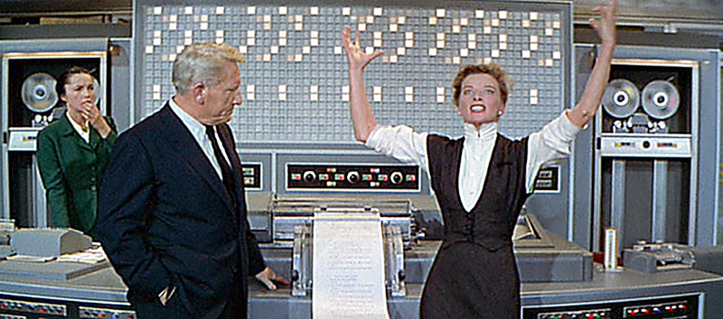

# Beep (a mad scientist's Keyboard Sounds profile)



A tiny, ridiculous Keyboard Sounds profile that makes your typing sound like a
1960s campy sci-fi mad scientist computer. It is just one beep sample pitched
down and up across 12 semitones, but it is surprisingly fun to use.

**Profile name:** `beep`
**Author:** RebelMastermind

**What you get**
- 25 pitched beep samples (original + 12 down + 12 up)
- A simple profile that randomly selects the pitch-shifted beeps

**Install (GNOME Keyboard Sounds extension)**
Copy the `beep` folder into your profiles directory:

```bash
mkdir -p ~/.local/lib/python3.14/site-packages/keyboardsounds/profiles/
cp -r beep ~/.local/lib/python3.14/site-packages/keyboardsounds/profiles/
```

Then load the extension and select the `beep` profile in the keyboard section.

**Install (KeyboardSounds Pro by nathan-fiscaletti)**
This folder should also work as a profile there. Import or place the `beep`
folder where KeyboardSounds Pro looks for profiles, then select `beep`.

**Credits and license**
See `beep/LICENSE` for the original sample attribution and usage terms.
